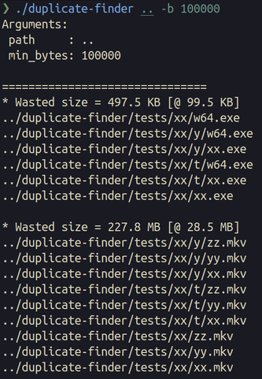

# File Duplicate Finder

Find Duplicate Finder is a tool that identifies and lists duplicate
files within a specified directory.
This utility is written in C and currently designed to
run seamlessly on POSIX-compliant systems.

## Build

```console
cc -O2 -o duplicate-finder
```

## Run

```console
duplicate-finder <PATH> -b <MIN_SIZE_BYTES>
```

e.g:
find duplicate files in parent directory with minimum size of 100 KB

```console
duplicate-finder .. -b 100000
```

Example output:



## References

- [Simple int hash function](https://stackoverflow.com/a/12996028)
- [djb2 hash function](https://gist.github.com/MohamedTaha98/ccdf734f13299efb73ff0b12f7ce429f)
- [Arena Allocator by Tsoding](https://github.com/tsoding/arena)
